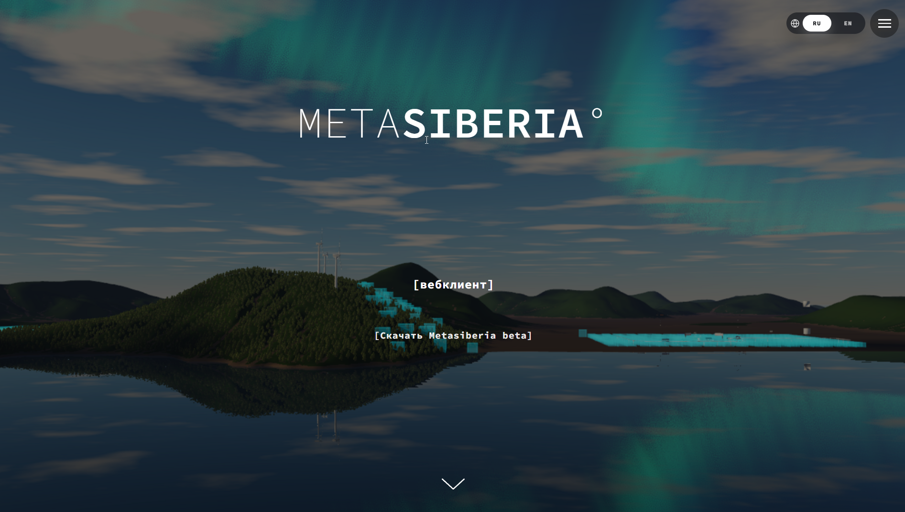

# Metasiberia Website

This repository contains the official website for Metasiberia.

Metasiberia is a virtual world project inspired by and based on the open-source Substrata software. The official Metasiberia source repository lives here:

- Official Metasiberia repository: https://github.com/shipilovden/sub-metasiberia



## Quick Access

- Admin: https://vr.metasiberia.com/
- Signup: https://vr.metasiberia.com/signup
- Web Client: https://vr.metasiberia.com/webclient
- Website: https://metasiberia.com/

## Community and Support

- VK: https://vk.com/metasiberia_official
- Telegram: https://t.me/metasiberia_official

## Credits

Metasiberia is inspired by and built on Substrata.

- Official Metasiberia repository: https://github.com/shipilovden/sub-metasiberia
- Metasiberia website repository: https://github.com/shipilovden/metasiberia_site_official

## About This Repository

This repository is focused on the public website at `https://metasiberia.com/`.

If you are looking for the main Metasiberia codebase, use the official repository:

- https://github.com/shipilovden/sub-metasiberia

## Local Preview

```bash
npm run dev
```

Default local URL:

- http://127.0.0.1:8000/

Production deployment for this website is done on REG.RU.
